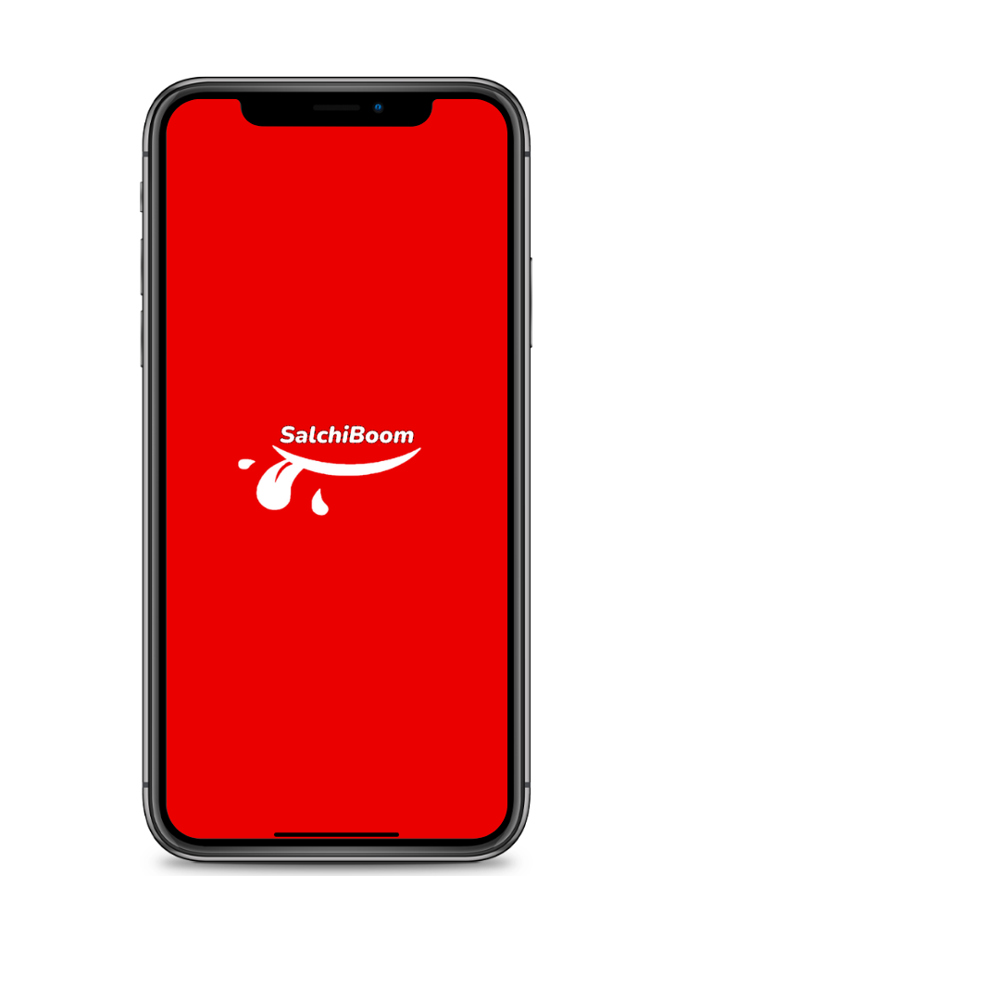

# [🍔SalchiBoom🍔](https://www.figma.com/proto/mM4dnzuRfXycxZJnjydGVo/Mapa?node-id=45-95&node-type=frame&t=W6D1BGtgHvrUYwic-0&scaling=scale-down&content-scaling=fixed&page-id=0%3A1&starting-point-node-id=55%3A95)

### Tabla de contenido
- [🍔SalchiBoom🍔](#salchiboom)
    - [Tabla de contenido](#tabla-de-contenido)
  - [📄Descripción](#descripción)
  - [👨‍💻Tecnologías utilizadas](#tecnologías-utilizadas)
  - [Entidades](#entidades)
      - [salchiboom](#salchiboom-1)
      - [Usuarios](#usuarios)
      - [Repartidores](#repartidores)
      - [Productos](#productos)
      - [Categoria](#categoria)
      - [Pedidos](#pedidos)
      - [Carrito](#carrito)
      - [Metodo\_Pago](#metodo_pago)
      - [Historial\_Pago](#historial_pago)
      - [Reseña\_Producto](#reseña_producto)
      - [Direccion\_Envio](#direccion_envio)
      - [Historial\_Pedido](#historial_pedido)
      - [Cupones](#cupones)
      - [Restaurantes](#restaurantes)
      - [Inventario](#inventario)

## 📄Descripción
Este es una aplicación de entrega de comida llamada **SalchiBoom**. Especializada en ofrecer hamburguesas de alta calidad. Nuestra misión es proporcionar **experiencias sabrosas** y **momentos felices** para nuestros usuarios, con un solo clic.

## 👨‍💻Tecnologías utilizadas
<table>
  <thead>
    <tr>
      <th>Figma</th>
      <th>Oracle</th>
      <th>MySQL Workbench</th>
    </tr>
  </thead>
  <tbody>
    <td>
        
    </td>
    <td>
        
    </td>
    <td>
        
    </td>
    <td>
        
    </td>
  </tbody>
</table>

## Entidades
#### salchiboom
| Attribute         | Type          |
| ----------------- | ------------- |
|                   |               |
|                   |               |
|                   |               |
|                   |               |

#### Usuarios
| Attribute         | Type          |
| ----------------- | ------------- |
|                   |               |
|                   |               |
|                   |               |
|                   |               |

#### Repartidores
| Attribute         | Type          |
| ----------------- | ------------- |
|                   |               |
|                   |               |
|                   |               |
|                   |               |

#### Productos
| Attribute         | Type          |
| ----------------- | ------------- |
|                   |               |
|                   |               |
|                   |               |
|                   |               |

#### Categoria
| Attribute         | Type          |
| ----------------- | ------------- |
|                   |               |
|                   |               |
|                   |               |
|                   |               |

#### Pedidos
| Attribute         | Type          |
| ----------------- | ------------- |
|                   |               |
|                   |               |
|                   |               |
|                   |               |

#### Carrito
| Attribute         | Type          |
| ----------------- | ------------- |
|                   |               |
|                   |               |
|                   |               |
|                   |               |

#### Metodo_Pago
| Attribute         | Type          |
| ----------------- | ------------- |
|                   |               |
|                   |               |
|                   |               |
|                   |               |

#### Historial_Pago
| Attribute         | Type          |
| ----------------- | ------------- |
|                   |               |
|                   |               |
|                   |               |
|                   |               |

#### Reseña_Producto
| Attribute         | Type          |
| ----------------- | ------------- |
|                   |               |
|                   |               |
|                   |               |
|                   |               |

#### Direccion_Envio
| Attribute         | Type          |
| ----------------- | ------------- |
|                   |               |
|                   |               |
|                   |               |
|                   |               |

#### Historial_Pedido
| Attribute         | Type          |
| ----------------- | ------------- |
|                   |               |
|                   |               |
|                   |               |
|                   |               |

#### Cupones
| Attribute         | Type          |
| ----------------- | ------------- |
|                   |               |
|                   |               |
|                   |               |
|                   |               |

#### Restaurantes
| Attribute         | Type          |
| ----------------- | ------------- |
|                   |               |
|                   |               |
|                   |               |
|                   |               |

#### Inventario
| Attribute         | Type          |
| ----------------- | ------------- |
|                   |        
|                   |               |    |   
|                           |
       |    |   
|                           |