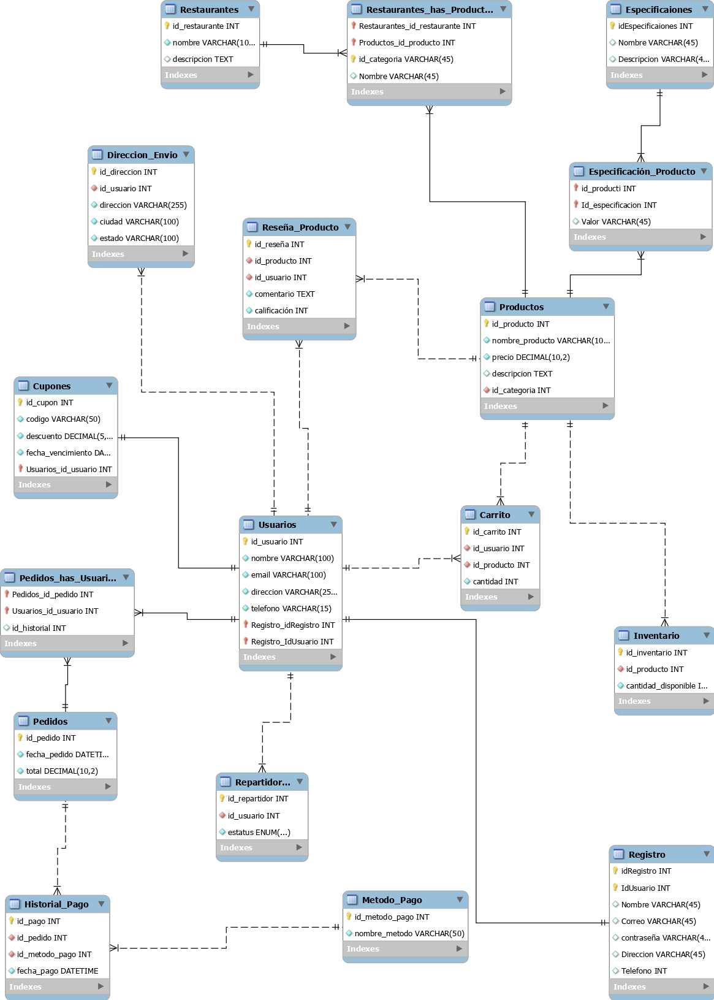

# [🍔SalchiBoom🍔](https://www.figma.com/proto/mM4dnzuRfXycxZJnjydGVo/Mapa?node-id=45-95&node-type=frame&t=W6D1BGtgHvrUYwic-0&scaling=scale-down&content-scaling=fixed&page-id=0%3A1&starting-point-node-id=55%3A95)


### Tabla de contenido
- [🍔SalchiBoom🍔](#salchiboom)
    - [Tabla de contenido](#tabla-de-contenido)
  - [Objetivos](#objetivos)
    - [Objetivo general](#objetivo-general)
    - [Objetivos específicos](#objetivos-específicos)
  - [👨‍💻Tecnologías utilizadas](#tecnologías-utilizadas)
  - [Tablas y Atributos](#tablas-y-atributos)
      - [Usuarios](#usuarios)
      - [Repartidores](#repartidores)
      - [Restaurantes\_has\_Productos](#restaurantes_has_productos)
      - [Productos](#productos)
      - [Pedidos\_has\_usuarios](#pedidos_has_usuarios)
      - [Pedidos](#pedidos)
      - [Carrito](#carrito)
      - [Metodo\_Pago](#metodo_pago)
      - [Historial\_Pago](#historial_pago)
      - [Reseña\_Producto](#reseña_producto)
      - [Direccion\_Envio](#direccion_envio)
      - [Especificación\_Producto](#especificación_producto)
      - [Cupones](#cupones)
      - [Restaurantes](#restaurantes)
      - [Inventario](#inventario)
      - [Especificaciones](#especificaciones)
      - [Registro](#registro)
  - [Relaciones entre tablas](#relaciones-entre-tablas)
  - [Diagrama Entidad-Relación](#diagrama-entidad-relación)
  - [Script de Creación de Tablas para Oracle DB](#script-de-creación-de-tablas-para-oracle-db)
  - [Script de Consultas SELECT para Oracle DB](#script-de-consultas-select-para-oracle-db)

## Objetivos
### Objetivo general
Desarrollar una aplicación móvil que permita a los usuarios realizar pedidos de comida rápida de manera eficiente, con una experiencia de usuario optimizada que permita la programación de pedidos y el seguimiento en tiempo real.
### Objetivos específicos
- Ofrecer una interfaz de usuario intuitiva y de fácil acceso para usuarios de diferentes edades y niveles de conocimiento tecnológico.
  
- Integrar un sistema de pago en línea seguro, rápido y versátil para facilitar las transacciones.
  
- Implementar un sistema de seguimiento en tiempo real de los pedidos, desde su preparación hasta la entrega.
## 👨‍💻Tecnologías utilizadas
<table>
  <thead>
    <tr>
      <th>Figma</th>
      <th>Oracle</th>
      <th>MySQL Workbench</th>
      <th>Google Docs</th>
    </tr>
  </thead>
  <tbody>
    <td>
        
    </td>
    <td>
        
    </td>
    <td>
        
    </td>
    <td>
        
    </td>
  </tbody>
</table>

## Tablas y Atributos

#### Usuarios

| Attribute         | Type          |
| ----------------- | ------------- |
| id_usuario        |  number       |
| Nombre            |Varchar2(25)   |
| Email             |Varchar2(25)   |
| Dirección         |  Text         |
| Teléfono          |Varchar2(25)   |

#### Repartidores

| Attribute         | Type          |
| ----------------- | ------------- |
| Id_repartidor     |     number    |
| estatus           |     NUMBER  |

#### Restaurantes_has_Productos

| Attribute         | Type          |
| ----------------- | ------------- |
|id_categoria       | Varchar2(45)  |
|Nombre             | Varchar2(45)  |

#### Productos

| Attribute         | Type          |
| ----------------- | ------------- |
| id_producto       | number        |
| Nombre            |Varchar2(10)   |
| Precio            | Decimal(10, 2)|
| Descripción       | Text          |

#### Pedidos_has_usuarios

| Attribute         | Type          |
| ----------------- | ------------- |
| id_historial      | number        |

#### Pedidos

| Attribute         | Type          |
| ----------------- | ------------- |
| id_pedido         |     number    |
| fecha_pedido      |     Date      |
| total             |  Decimal      |

#### Carrito

| Attribute         | Type          |
| ----------------- | ------------- |
| id_carrito        |     number    |
| Cantidad          |     number    |

#### Metodo_Pago

| Attribute         | Type          |
| ----------------- | ------------- |
| Id_método_pago    |      number   |
| Nombre            |Varchar2(25)   |

#### Historial_Pago

| Attribute         | Type          |
| ----------------- | ------------- |
| id_pago           |    number     |
| fecha_pago        |    Date       |

#### Reseña_Producto

| Attribute         | Type          |
| ----------------- | ------------- |
| id_reseña         |     number    |
| comentario        |     CLOB      |
| Calificacion      |     number    |

#### Direccion_Envio

| Attribute         | Type          |
| ----------------- | ------------- |
| id_direccion      |  number       |
| direccion         | Varchar2(25)  |
| ciudad            | Varchar2(15)  |
| estado            | Varchar2(15)  |


#### Especificación_Producto

| Attribute         | Type          |
| ----------------- | ------------- |
| valor             |Varchar(45)    |

#### Cupones

| Attribute         | Type          |
| ----------------- | ------------- |
| id_cupon          |  number       |
| codigo            |Varchar2(25)   |
| descuento         |Varchar2(25)   |
| fecha_vencimiento |Varchar2(25)   |

#### Restaurantes

| Attribute         | Type          |
| ----------------- | ------------- |
|  id_restaurante   |  number       |
|  Nombre           | Varchar2(10)  |
|  Descripción      |  clob         |

#### Inventario

| Attribute         | Type          |
| ----------------- | ------------- |
| id_inventario     |     number    |
| Cantidad          |     number    |

#### Especificaciones

| Attribute         | Type          |
| ----------------- | ------------- |
| id_especificacion |     number    |
| Nombre            |     number    |
| Descripción       |     number    |

#### Registro

| Attribute         | Type          |
| ----------------- | ------------- |
| id_registro       |     number    |
| id_usuario        |     number    |
| correo            | Varchar2(25)  |
| contraseña        | Varchar2(25)  |
| direccion         | Varchar2(45)  |
| telefono          | Varchar2(15)  |
| Nombre            | Varchar2(25)  |


## Relaciones entre tablas

- **Usuarios** esta relacionada con:
  -Carrito
  - Direccion_Envio
  - Cupones
  - Repartidores
  - Registro
  - Reseña_Producto
  - Pedidos_has_usuarios

- **Repartidores** esta relacionada con:
  - Usuarios

- **Productos** esta relacionada con:
  - Reseña_producto
  - Especificación_Producto
  - Inventario
  - Carrito
  - Categoria

- **Pedidos** esta relacionada con:
  - Historial_Pago
  - Historial_pedidos

- **Carrito** esta relacionada con:
  - Productos
  - Usuarios

- **Metodo_Pago** esta relacionada con:
  - Historial_Pago

- **Historial_Pago** esta relacionada con:
  - Pedidos
  - Historial_Pedidos

- **Reseña_Producto** esta relacionada con:
  - Productos
  - Usuarios

- **Direccion_Envio** esta relacionada con:
  - Usuarios

- **Categorías** esta relacionada con:
  - Restaurantes
  - Productos 

- **Cupones** esta relacionada con:
  - Usuarios

- **Restaurantes** esta relacionada con:
  - Categoria

- **Inventario** esta relacionada con:
  - Productos

## Diagrama Entidad-Relación



## Script de Creación de Tablas para Oracle DB

```sql

-- Tabla Registro
CREATE TABLE Registro (
    idRegistro NUMBER GENERATED ALWAYS AS IDENTITY PRIMARY KEY,
    Nombre VARCHAR2(45) NOT NULL,
    Correo VARCHAR2(25) NOT NULL,
    Contraseña VARCHAR2(25) NOT NULL,
    Direccion VARCHAR2(25),
    Telefono VARCHAR2(20),
    CONSTRAINT uq_Registro_Correo UNIQUE (Correo)
);

-- Tabla Especificaciones
CREATE TABLE Especificaciones (
    idEspecificacion NUMBER GENERATED ALWAYS AS IDENTITY PRIMARY KEY,
    Nombre VARCHAR2(25) NOT NULL,
    Descripcion CLOB
);

-- Tabla Especificacion_Producto
CREATE TABLE Especificacion_Producto (
    id_producto NUMBER NOT NULL,
    id_especificacion NUMBER NOT NULL,
    Valor VARCHAR2(25),
    PRIMARY KEY (id_producto, id_especificacion),
    CONSTRAINT fk_Espec_Producto_Producto
        FOREIGN KEY (id_producto)
        REFERENCES Productos (id_producto)
        ON DELETE CASCADE,
    CONSTRAINT fk_Espec_Producto_Especificacion
        FOREIGN KEY (id_especificacion)
        REFERENCES Especificaciones (idEspecificacion)
        ON DELETE CASCADE
);

-- Cambiar al schema 'salchiboom'
ALTER SESSION SET CURRENT_SCHEMA = salchiboom;

-- Tabla Categoria
CREATE TABLE Categoria (
    id_categoria NUMBER GENERATED ALWAYS AS IDENTITY PRIMARY KEY,
    nombre_categoria VARCHAR2(25) NOT NULL,
    CONSTRAINT uq_Categoria_nombre_categoria UNIQUE (nombre_categoria)
);

-- Tabla Productos
CREATE TABLE Productos (
    id_producto NUMBER GENERATED ALWAYS AS IDENTITY PRIMARY KEY,
    nombre_producto VARCHAR2(25) NOT NULL,
    precio NUMBER(10,2) NOT NULL,
    descripcion CLOB,
    id_categoria NUMBER NOT NULL,
    stock NUMBER DEFAULT 0,
    valoracion NUMBER(2,1),
    CONSTRAINT fk_Productos_Categoria
        FOREIGN KEY (id_categoria)
        REFERENCES Categoria (id_categoria)
        ON DELETE CASCADE,
    CONSTRAINT chk_Productos_valoracion
        CHECK (valoracion BETWEEN 0 AND 5)
);

-- Tabla Usuarios
CREATE TABLE Usuarios (
    id_usuario NUMBER GENERATED ALWAYS AS IDENTITY PRIMARY KEY,
    nombre VARCHAR2(25) NOT NULL,
    email VARCHAR2(25) NOT NULL,
    direccion VARCHAR2(25) NOT NULL,
    telefono VARCHAR2(20) NOT NULL,
    idRegistro NUMBER,
    CONSTRAINT uq_Usuarios_email UNIQUE (email),
    CONSTRAINT fk_Usuarios_Registro
        FOREIGN KEY (idRegistro)
        REFERENCES mydb.Registro (idRegistro)
        ON DELETE SET NULL,
    CONSTRAINT chk_Usuarios_telefono
        CHECK (telefono LIKE '+%' OR telefono LIKE '0%' OR REGEXP_LIKE(telefono, '^[0-9+]+$'))
);

-- Tabla Repartidores
CREATE TABLE Repartidores (
    id_repartidor NUMBER GENERATED ALWAYS AS IDENTITY PRIMARY KEY,
    id_usuario NUMBER NOT NULL UNIQUE,
    estatus VARCHAR2(10) NOT NULL DEFAULT 'activo',
    CONSTRAINT fk_Repartidores_Usuarios
        FOREIGN KEY (id_usuario)
        REFERENCES Usuarios (id_usuario)
        ON DELETE CASCADE,
    CONSTRAINT chk_Repartidores_estatus
        CHECK (estatus IN ('activo', 'inactivo'))
);

-- Tabla Pedidos
CREATE TABLE Pedidos (
    id_pedido NUMBER GENERATED ALWAYS AS IDENTITY PRIMARY KEY,
    fecha_pedido TIMESTAMP NOT NULL DEFAULT CURRENT_TIMESTAMP,
    total NUMBER(10,2) NOT NULL
);

-- Tabla Carrito
CREATE TABLE Carrito (
    id_carrito NUMBER GENERATED ALWAYS AS IDENTITY PRIMARY KEY,
    id_usuario NUMBER NOT NULL,
    id_producto NUMBER NOT NULL,
    cantidad NUMBER NOT NULL DEFAULT 1,
    CONSTRAINT fk_Carrito_Usuarios
        FOREIGN KEY (id_usuario)
        REFERENCES Usuarios (id_usuario)
        ON DELETE CASCADE,
    CONSTRAINT fk_Carrito_Productos
        FOREIGN KEY (id_producto)
        REFERENCES Productos (id_producto)
        ON DELETE CASCADE,
    CONSTRAINT uq_Carrito_usuario_producto UNIQUE (id_usuario, id_producto)
);

-- Tabla Metodo_Pago
CREATE TABLE Metodo_Pago (
    id_metodo_pago NUMBER GENERATED ALWAYS AS IDENTITY PRIMARY KEY,
    nombre_metodo VARCHAR2(50) NOT NULL,
    CONSTRAINT uq_Metodo_Pago_nombre_metodo UNIQUE (nombre_metodo)
);

-- Tabla Historial_Pago
CREATE TABLE Historial_Pago (
    id_pago NUMBER GENERATED ALWAYS AS IDENTITY PRIMARY KEY,
    id_pedido NUMBER NOT NULL,
    id_metodo_pago NUMBER NOT NULL,
    fecha_pago TIMESTAMP NOT NULL DEFAULT CURRENT_TIMESTAMP,
    CONSTRAINT fk_HistorialPago_Pedidos
        FOREIGN KEY (id_pedido)
        REFERENCES Pedidos (id_pedido)
        ON DELETE CASCADE,
    CONSTRAINT fk_HistorialPago_MetodoPago
        FOREIGN KEY (id_metodo_pago)
        REFERENCES Metodo_Pago (id_metodo_pago)
);

-- Tabla Reseña_Producto
CREATE TABLE "Reseña_Producto" (
    id_reseña NUMBER GENERATED ALWAYS AS IDENTITY PRIMARY KEY,
    id_producto NUMBER NOT NULL,
    id_usuario NUMBER NOT NULL,
    comentario CLOB NOT NULL,
    calificación NUMBER NOT NULL,
    CONSTRAINT fk_ReseñaProducto_Productos
        FOREIGN KEY (id_producto)
        REFERENCES Productos (id_producto)
        ON DELETE CASCADE,
    CONSTRAINT fk_ReseñaProducto_Usuarios
        FOREIGN KEY (id_usuario)
        REFERENCES Usuarios (id_usuario)
        ON DELETE CASCADE,
    CONSTRAINT chk_ReseñaProducto_calificacion
        CHECK (calificación BETWEEN 1 AND 5)
);

-- Tabla Direccion_Envio
CREATE TABLE Direccion_Envio (
    id_direccion NUMBER GENERATED ALWAYS AS IDENTITY PRIMARY KEY,
    id_usuario NUMBER NOT NULL,
    direccion VARCHAR2(25) NOT NULL,
    ciudad VARCHAR2(25) NOT NULL,
    estado VARCHAR2(25) NOT NULL,
    CONSTRAINT fk_DireccionEnvio_Usuarios
        FOREIGN KEY (id_usuario)
        REFERENCES Usuarios (id_usuario)
        ON DELETE CASCADE
);

-- Tabla Historial_Pedido
CREATE TABLE Historial_Pedido (
    id_historial NUMBER GENERATED ALWAYS AS IDENTITY PRIMARY KEY,
    id_pedido NUMBER NOT NULL,
    estatus VARCHAR2(20) NOT NULL,
    CONSTRAINT fk_HistorialPedido_Pedidos
        FOREIGN KEY (id_pedido)
        REFERENCES Pedidos (id_pedido)
        ON DELETE CASCADE,
    CONSTRAINT chk_HistorialPedido_estatus
        CHECK (estatus IN ('en preparación', 'en camino', 'entregado', 'cancelado'))
);

-- Tabla Cupones
CREATE TABLE Cupones (
    id_cupon NUMBER GENERATED ALWAYS AS IDENTITY,
    Usuarios_id_usuario NUMBER NOT NULL,
    codigo VARCHAR2(7) NOT NULL,
    descuento NUMBER(5,2) NOT NULL,
    fecha_vencimiento DATE NOT NULL,
    PRIMARY KEY (id_cupon, Usuarios_id_usuario),
    CONSTRAINT fk_Cupones_Usuarios
        FOREIGN KEY (Usuarios_id_usuario)
        REFERENCES Usuarios (id_usuario)
        ON DELETE CASCADE,
    CONSTRAINT uq_Cupones_codigo UNIQUE (codigo),
    CONSTRAINT chk_Cupones_descuento
        CHECK (descuento BETWEEN 0 AND 100)
);

-- Tabla Restaurantes
CREATE TABLE Restaurantes (
    id_restaurante NUMBER GENERATED ALWAYS AS IDENTITY PRIMARY KEY,
    nombre VARCHAR2(25) NOT NULL,
    "Horario_atención" CLOB,
    CONSTRAINT uq_Restaurantes_nombre UNIQUE (nombre)
);

-- Tabla Inventario
CREATE TABLE Inventario (
    id_inventario NUMBER GENERATED ALWAYS AS IDENTITY PRIMARY KEY,
    id_producto NUMBER NOT NULL,
    cantidad_disponible NUMBER NOT NULL,
    CONSTRAINT fk_Inventario_Productos
        FOREIGN KEY (id_producto)
        REFERENCES Productos (id_producto)
        ON DELETE CASCADE
);

-- Tabla Pedidos_has_Usuarios
CREATE TABLE Pedidos_has_Usuarios (
    Pedidos_id_pedido NUMBER NOT NULL,
    Usuarios_id_usuario NUMBER NOT NULL,
    id_historial NUMBER,
    PRIMARY KEY (Pedidos_id_pedido, Usuarios_id_usuario),
    CONSTRAINT fk_Pedidos_has_Usuarios_Pedidos
        FOREIGN KEY (Pedidos_id_pedido)
        REFERENCES Pedidos (id_pedido)
        ON DELETE CASCADE,
    CONSTRAINT fk_Pedidos_has_Usuarios_Usuarios
        FOREIGN KEY (Usuarios_id_usuario)
        REFERENCES Usuarios (id_usuario)
        ON DELETE CASCADE
);

-- Tabla Restaurantes_has_Productos
CREATE TABLE Restaurantes_has_Productos (
    Restaurantes_id_restaurante NUMBER NOT NULL,
    Productos_id_producto NUMBER NOT NULL,
    id_categoria VARCHAR2(45) NOT NULL,
    Nombre VARCHAR2(45),
    PRIMARY KEY (Restaurantes_id_restaurante, Productos_id_producto, id_categoria),
    CONSTRAINT fk_Restaurantes_has_Productos_Restaurantes
        FOREIGN KEY (Restaurantes_id_restaurante)
        REFERENCES Restaurantes (id_restaurante)
        ON DELETE CASCADE,
    CONSTRAINT fk_Restaurantes_has_Productos_Productos
        FOREIGN KEY (Productos_id_producto)
        REFERENCES Productos (id_producto)
        ON DELETE CASCADE,
    CONSTRAINT uq_Restaurantes_has_Productos_id_categoria UNIQUE (id_categoria)
);
```

## Script de Consultas SELECT para Oracle DB
```sql

-- 1. Selección Básica con DISTINCT

SELECT DISTINCT nombre_categoria
FROM Categoria;


-- 2. Agregaciones con COUNT, AVG, MIN, MAX, SUM

SELECT 
    COUNT(*) AS total_productos,
    AVG(precio) AS precio_promedio,
    MIN(precio) AS precio_minimo,
    MAX(precio) AS precio_maximo,
    SUM(stock) AS stock_total
FROM Productos;


-- 3. Filtrado con WHERE y Operadores Lógicos

SELECT nombre, precio, stock
FROM Productos
WHERE precio > 50 AND stock < 100;


-- 4. Ordenamiento con ORDER BY y DESC

SELECT nombre_producto, precio
FROM Productos
ORDER BY precio DESC;


-- 5. Agrupamiento con GROUP BY y HAVING

SELECT id_categoria, COUNT(*) AS total_productos
FROM Productos
GROUP BY id_categoria
HAVING COUNT(*) > 10;


-- 6. Unión de Tablas con INNER JOIN

SELECT u.nombre, p.nombre_producto, p.precio
FROM Usuarios u
INNER JOIN Pedidos_has_Usuarios pu ON u.id_usuario = pu.Usuarios_id_usuario
INNER JOIN Pedidos p ON pu.Pedidos_id_pedido = p.id_pedido;


-- 7. Unión de Tablas con LEFT JOIN

SELECT u.nombre, r.estatus
FROM Usuarios u
LEFT JOIN Repartidores r ON u.id_usuario = r.id_usuario;


-- 8. Subconsulta en la Cláusula WHERE con EXISTS

SELECT nombre_producto, precio
FROM Productos p
WHERE EXISTS (
    SELECT 1 
    FROM Carrito c
    WHERE c.id_producto = p.id_producto
);


-- 9. Subconsulta en la Cláusula SELECT

SELECT 
    nombre_producto,
    precio,
    (SELECT AVG(precio) FROM Productos) AS precio_promedio_general
FROM Productos;


-- 10. Uso de Funciones de Cadena como UPPER y LOWER

SELECT UPPER(nombre) AS nombre_mayusculas, LOWER(direccion) AS direccion_minusculas
FROM Usuarios;


-- 11. Uso de CASE para Lógica Condicional

SELECT nombre_producto,
    CASE 
        WHEN stock > 100 THEN 'Abundante'
        WHEN stock BETWEEN 50 AND 100 THEN 'Moderado'
        ELSE 'Bajo'
    END AS nivel_stock
FROM Productos;


-- 12. Filtrado con IN

SELECT nombre, email
FROM Usuarios
WHERE id_usuario IN (1, 2, 3, 4, 5);


-- 13. Filtrado con BETWEEN

SELECT nombre_producto, precio
FROM Productos
WHERE precio BETWEEN 20 AND 100;


-- 14. Manejo de NULL con NVL y COALESCE

SELECT nombre, NVL(direccion, 'No proporcionada') AS direccion,
       COALESCE(telefono, 'Sin teléfono') AS telefono
FROM Usuarios;


-- 15. Uso de Funciones de Fecha como TRUNC y ADD_MONTHS

SELECT id_pedido, fecha_pedido, 
       TRUNC(fecha_pedido, 'MONTH') AS inicio_mes,
       ADD_MONTHS(fecha_pedido, 1) AS siguiente_mes
FROM Pedidos;


-- 16. Uso de Window Functions como ROW_NUMBER y RANK

SELECT 
    nombre_producto,
    precio,
    ROW_NUMBER() OVER (ORDER BY precio DESC) AS fila_precio,
    RANK() OVER (ORDER BY precio DESC) AS rango_precio
FROM Productos;


-- 17. Uso de Common Table Expressions (WITH)

WITH Productos_Categoria AS (
    SELECT p.nombre_producto, c.nombre_categoria
    FROM Productos p
    INNER JOIN Categoria c ON p.id_categoria = c.id_categoria
)
SELECT nombre_categoria, COUNT(*) AS total_productos
FROM Productos_Categoria
GROUP BY nombre_categoria;


-- 18. Uso de PIVOT

SELECT *
FROM (
    SELECT c.nombre_categoria, p.precio
    FROM Productos p
    INNER JOIN Categoria c ON p.id_categoria = c.id_categoria
)
PIVOT (
    AVG(precio) 
    FOR nombre_categoria IN ('Bebidas', 'Snacks', 'Postres')
);


-- 19. Uso de UNION y UNION ALL

-- UNION elimina duplicados
SELECT nombre, email FROM Usuarios
WHERE direccion LIKE '%Madrid%'

UNION

SELECT nombre, email FROM Usuarios
WHERE direccion LIKE '%Barcelona%';

-- UNION ALL incluye duplicados
SELECT nombre, email FROM Usuarios
WHERE direccion LIKE '%Madrid%'

UNION ALL

SELECT nombre, email FROM Usuarios
WHERE direccion LIKE '%Barcelona%';


-- 20. Filtrado con LIKE y Wildcards

SELECT nombre_producto, descripcion
FROM Productos
WHERE descripcion LIKE '%delicioso%';


-- 21. Uso de REGEXP_LIKE para Filtrado Avanzado

SELECT nombre, telefono
FROM Usuarios
WHERE REGEXP_LIKE(telefono, '^\+?[0-9]{10,15}$');


-- 22. Uso de EXISTS con Subconsultas Correlacionadas

SELECT u.nombre, u.email
FROM Usuarios u
WHERE EXISTS (
    SELECT 1
    FROM Carrito c
    WHERE c.id_usuario = u.id_usuario AND c.cantidad > 5
);


-- 23. Uso de CONNECT BY para Consultas Jerárquicas

SELECT LEVEL, nombre_restaurante, id_restaurante
FROM Restaurantes
START WITH id_restaurante = 1
CONNECT BY PRIOR id_restaurante = parent_id_restaurante;


-- 24. Uso de CTE Recursivas
-- *Nota:* Oracle soporta CTEs recursivas usando WITH y CONNECT BY. Ajusta según tu estructura.

WITH Categoria_Hierarchy AS (
    SELECT id_categoria, nombre_categoria, NULL AS parent_id
    FROM Categoria
    WHERE parent_id IS NULL
    UNION ALL
    SELECT c.id_categoria, c.nombre_categoria, c.parent_id
    FROM Categoria c
    INNER JOIN Categoria_Hierarchy ch ON c.parent_id = ch.id_categoria
)
SELECT * FROM Categoria_Hierarchy;


-- 25. Uso de FETCH y OFFSET para Paginación

SELECT nombre_producto, precio
FROM Productos
ORDER BY precio DESC
OFFSET 10 ROWS FETCH NEXT 10 ROWS ONLY;

```

